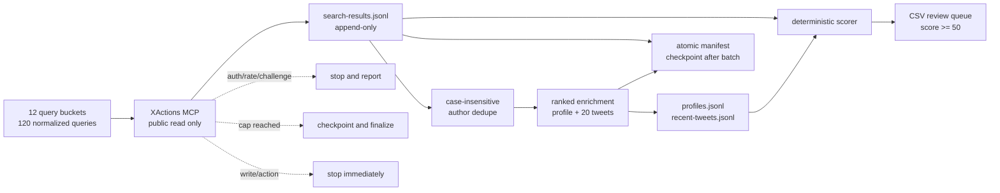

# Architecture

## Context

Marx prospect research needs broad enough discovery to find agent builders,
founders, quant/developer users, infrastructure builders, and explicit buyers,
while preserving dated public evidence and preventing accidental X actions.

## Data flow

## Responsibilities

### XActions MCP

The MCP tools are the primary source and perform only public search, profile,
and timeline reads. They are called sequentially by the Codex app. The local
runner never receives or stores credentials.

### Local runner

`scripts/run-comprehensive.mjs` owns:

- query-plan freezing and run-directory creation;
- atomic manifest writes using temporary-file rename;
- append-only raw JSONL persistence;
- case-insensitive username and tweet ID/URL deduplication;
- an atomic per-run lock that rejects concurrent mutation;
- canonical X URL, handle, ID, and frozen-window timestamp validation;
- sanitized error classification and fail-closed status;
- scorer-compatible export, report, and standalone SVG generation.

### Deterministic scorer

The scorer is selected explicitly by CLI, environment, or frozen policy. The
current reference implementation lives in the external scorer bundle and
applies transparent lexical signals and penalties. A score is a heuristic for
review prioritization, not a claim that the person is a Marx customer or is
qualified for contact.

## Key decisions

- Public read-only MCP is the source of truth for a run; no silent fallback mixing.
- JSONL is used for recovery so the whole dataset is not rewritten after every call.
- Each run is timestamped to preserve previous outputs and enable auditability.
- Human review is the boundary between an evidence-backed candidate and outreach.
- Network expansion and every write action remain disabled.

## Failure behavior

Authentication, rate limits, challenges, policy failures, three repeated
runtime failures, caps, and any write/action attempt are explicit state, not
successful empty results. The run is finalized with its stop reason and counts.

A non-stopped run can be finalized only after the control check passes and all
frozen search queries reach a terminal state. A stopped run may be finalized to
preserve partial evidence and its stop reason. Finalized runs reject mutation.
