# Daily two-system architecture

```mermaid
flowchart LR
  A[Mac command / future Hermes clock] --> B[Run lock + kill switch]
  B --> C[XActions MCP read allowlist]
  C --> D[Normalize + evidence hash]
  D --> E[SQLite posts/accounts/contexts]
  E --> F[Deterministic relevance + dedupe]
  F --> G[Codex Exec: opportunity]
  G --> H[Codex Exec: generation]
  H --> I[Codex Exec: independent evaluation]
  I --> J[Deterministic anti-slop + duplicate QA]
  J --> K[Founder review JSON]
  J --> L[NO_ACTION]
  K --> M[V1 manual publication]
  K -. V2 automatic .-> N[Automated policy gate]
  N --> O[Hash-bound publication request]
  O --> P[Direct XActions write adapter]
  P --> Q[Read-back verification]
  Q --> R[Publication receipt or reconciliation]
```

System 1 owns bounded XActions reads and durable evidence. System 2 owns all
analysis, policy decisions, and V2 publication requests. Codex model workers
have no MCP tools and no publisher credentials; the separate writer owns only
the three configured write tools. V1 ends at founder review, while V2 requires
the explicit `auto` command and separate automatic configuration.
