# Daily two-system architecture

```mermaid
flowchart LR
  A[Mac command / future Hermes clock] --> B[Run lock + kill switch]
  B --> C[XActions MCP read allowlist]
  C --> D[Normalize + evidence hash]
  D --> E[SQLite posts/accounts/contexts]
  E --> F[Deterministic relevance + dedupe]
  F --> G[Codex Exec: opportunity]
  G --> H[Codex Exec: generation]
  H --> I[Codex Exec: independent evaluation]
  I --> J[Deterministic anti-slop + duplicate QA]
  J --> K[Founder review JSON]
  J --> L[NO_ACTION]
  K --> M[V1 manual publication]
  K -. V2 dormant .-> N[Hash-bound Hermes request]
  N -. disabled .-> O[Receipt/reconciliation contract]
```

System 1 owns only bounded, experimental XActions reads and durable evidence.
System 2 owns all analysis and draft decisions. The model workers run with no
MCP tools and no publisher credentials. V1 ends at founder review; V2 cannot be
activated by a normal V1 command.
